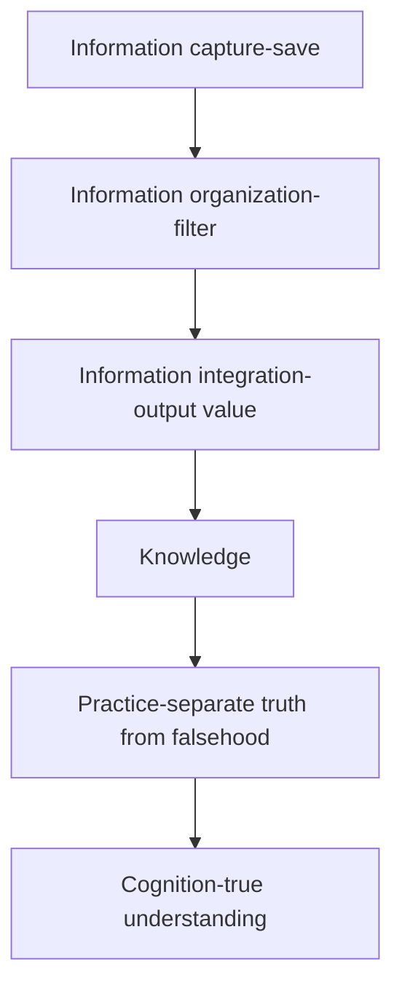

- All template will be saved in this folder
- Use shortcut `cmd + \` or `ctrl + \` to select the template we want to insert

> [!NOTE] Rename Folder
> Please rename this folder if needed.
> Suggested name: 2. template

## Template

Templates correspond to the types of note content mentioned earlier, and there are three types of templates in order: meeting and work diary templates, general templates, and card note templates.

[[2024-10-09-template-Emeria-work-today-meeting-jounal-task-backlog]] for Routine meetings and work diary notes

[[2024-09-02-template-Obsidian-action-add History]] for Task note

[[2024-09-10-模板-card-<subject>]] for Card notes

## Tools

### Mermaid

This is Obsidian's built-in drawing tool. The use of this tool requires some technical background (if you're willing to learn, it's not difficult to get started, and the benefits outweigh the time cost of learning). I now basically use it to draw diagrams. Its advantage is that unlike fixed images, it's easy to modify, almost equivalent to managing a list, and its image content can be searched because essentially it's still a bunch of text behind the scenes. Managing text is much easier than managing attachments.

Example: The Process of Information Generation

