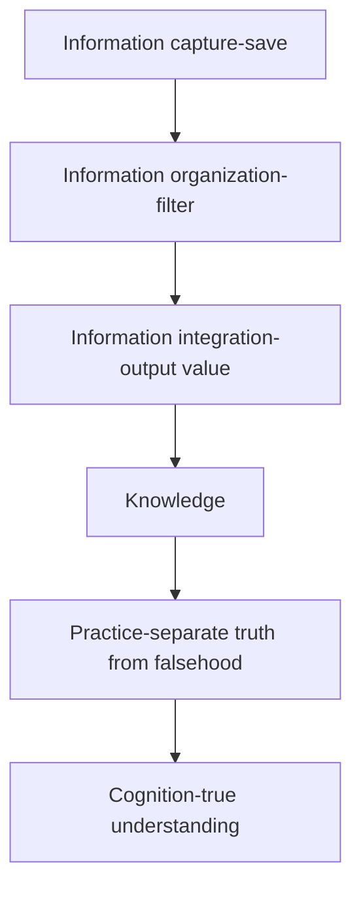

  <a href="https://github.com/xiaokatech/obsidian-notes/blob/master/2024-10-09-README-%E7%AC%94%E8%AE%B0%E7%AE%A1%E7%90%86-%E5%A6%82%E4%BD%95%E7%AE%A1%E7%90%86%E5%B7%A5%E4%BD%9C%E7%AC%94%E8%AE%B0%EF%BC%9F.md">简体中文</a> |
  <a href="https://github.com/xiaokatech/obsidian-notes/blob/master/2024-10-09-README-Note%20management-How%20to%20manage%20work%20notes%20%3F.md">English</a>

> [!NOTE] Glossary Issue
> There are some Chinese characters in the article. If you want to understand them, you can scroll to the Glossary at the end for more information.

#公司(company) #个人知识管理 (Personal knowledge management)

## Context

This is an simple note to present how I manage my notes about Emeria to help me in my job.

Some background of my experience for knowledge management:

- I start to do electronic note from 2017 in my second year of college, I have 8 years of experience in taking notes.
- I have a personal blog where I occasionally share some personal experiences and records.
- I have used a total of 6 note-taking software applications, and I have summarized, optimized, and even restructured my note-taking methods countless times.

To this day, this management approach has been integrated into all of my habits, both in my personal daily life and at work.

This method has already been taught to some of my friends, and they have given great feedback. I believe this is a valuable management approach for anyone.

> [!NOTE] Note
> This content is not about teaching a specific technical framework, but rather a method for managing text notes. If needed, everyone can develop their own management approach based on this foundation.

## Three simple principals

- Easy access to all notes through a simple entry point --> Directory design
- Avoid writing the same content repeatedly as much as possible --> Content type - corresponding to template functionality, double link with display
- No need to worry about note details, preferably with automatic formatting --> Solved by plugins

## Directory design

- Subject: the directory consisting of recently focused topics.

![[2024-09-16-gif-38-项目-GPT AI Flow-emeria-subject-note.gif]]

- Category: the directory of completed topics or storage for a large number of old work notes.

![[2024-09-16-gif-39-项目-GPT AI Flow-emeria-category-note.gif]]

## Content

Among the types of content I record, there are three main categories that are most important: routine meetings and work diaries, task notes, and card notes.

- **Routine meetings and work diary notes** include a meeting section (including daily records and technical support), a today's section containing plans, completed work and ongoing work, next steps, and to-do items. It has a dedicated note structure, which I will share later.
- **Task notes** are records of each task, and the note structure consists of various recording methods and structures depending on the task. However, elements such as background (context), resources, and history will certainly be included.
- **Card notes**: I have only recently started taking card notes. In the past, I used to record card notes with different structures. However, recently, in combination with AI tools, I have designed a relatively stable note structure standard. It allows me to create new card notes quickly, which I will discuss later.

## Template

Templates correspond to the types of note content mentioned earlier, and there are three types of templates in order: meeting and work diary templates, general templates, and card note templates.

### Routine meetings and work diary notes

[[2024-10-09-template-Emeria-work-today-meeting-jounal-task-backlog]]

### General note

[[2024-09-02-template-Obsidian-action-add History]]

### Card notes

[[2024-09-10-模板-card-<subject>]]

> [!NOTE] Open source note library sharing
> These templates and shortcut settings have been open-sourced in my GitHub repository. If you want to use them directly, you can learn more through this link: https://github.com/xiaokatech/obsidian-notes

## Tools and Features

### Plugin

**Prettier Format**
The existence of this plugin means I don't need to worry about any formatting. As soon as I save, the formatting will automatically refresh and organize itself. The introduction of this tool comes from the same tool used in the process of automatically formatting code when writing code.

**Mermaid**
This is Obsidian's built-in drawing tool. The use of this tool requires some technical background (if you're willing to learn, it's not difficult to get started, and the benefits outweigh the time cost of learning). I now basically use it to draw diagrams. Its advantage is that unlike fixed images, it's easy to modify, almost equivalent to managing a list, and its image content can be searched because essentially it's still a bunch of text behind the scenes. Managing text is much easier than managing attachments.

Example: The Process of Information Generation

### Features

**Template Functionality**
Templates need to be used in conjunction with shortcuts, meaning I can quickly insert a template into a new note, adding a pre-written note framework that facilitates faster recording later. If we don't use this feature and focus too much on how to structure notes, we might overlook the truly important content part of the notes.

**Export Functionality**
Please remember that the work diaries we write are not necessarily for our eyes only. Therefore, in all my work task cards, I attach an exported PDF as a record of the note task, and when needed, I also write a summary PDF file. If our colleagues want to understand our work content, I can directly share a PDF file, or I can share the PDF I'm currently writing with colleagues, accept their opinions, and revise the PDF accordingly.
This is undoubtedly the biggest benefit that note-taking brings me besides recording. By exporting PDFs, it allows me to make the description of a task more and more complete, reduce friction in communication with colleagues, and provide rich content presentation.
Another advantage is that colleagues can provide clear feedback directly based on the black-and-white PDF, opening up a dedicated feedback channel based on specific documents.

### AI Tools

- ChatGPT
- Claude
- Google gemini
- GPT AI Flow
- etc

## Resource

- Link (option)
- Relevant notes (option)
    - [[2024-10-09-README-笔记管理-如何管理工作笔记？]]
- Glossary (option): [[2024-10-09-README-Glossary note]]
- Relevant query (option)

## History

- 2024.10.09, created by [xiaoka](https://www.xiaokaup.com/): first version
- Template: [[2024-09-02-template-Obsidian-action-add History]]
- Reference: [[What is the general format for citing articles?]]
