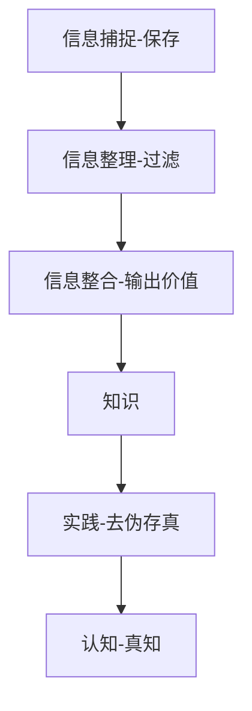

#README

  <a href="https://github.com/xiaokatech/obsidian-notes/blob/master/2024-10-09-README-%E7%AC%94%E8%AE%B0%E7%AE%A1%E7%90%86-%E5%A6%82%E4%BD%95%E7%AE%A1%E7%90%86%E5%B7%A5%E4%BD%9C%E7%AC%94%E8%AE%B0%EF%BC%9F.md">简体中文</a> |
  <a href="https://github.com/xiaokatech/obsidian-notes/blob/master/2024-10-09-README-Note%20management-How%20to%20manage%20work%20notes%20%3F.md">English</a>

## Context

#公司(company) #个人知识管理 (Personal knowledge management)

## 背景

这是一个简单的笔记，展示了我如何管理与 Emeria 相关的笔记，以帮助我在工作中。

以下是我在知识管理方面的一些经验背景：

- 我从 2017 年大二开始做电子笔记，已有 8 年的记笔记经验。
- 我有个人博客，偶尔会分享一些个人经历和记录。
- 我总共使用过 6 种笔记软件，并且无数次总结、优化甚至重构我的记笔记方法

时至今日,这种管理方法已经融入我的所有习惯中,无论是在个人日常生活还是工作中。

这种方法已经传授给我的一些朋友,他们给出了很好的反馈。我相信这是一种对任何人都有价值的管理方法。

> [!NOTE] 注意
> 这里的内容不是关于教授特定的技术框架,而是一种管理文本笔记的方法。如果需要,每个人都可以在这个基础上发展出自己的管理方法。

## 三个简单原则

- 通过简单的入口点轻松访问所有笔记 --> 目录设计
- 尽可能避免重复书写相同内容 --> 内容类型 - 对应模板功能，双向链接与展示
- 无需担心笔记细节，最好能自动格式化 --> 通过插件解决

## 目录设计

- 主题的含义是，最近正在关注的主题组成的目录，而分类则是已经完成的主题或者说一个存储大量旧工作笔记的目录。

![[2024-09-16-gif-38-项目-GPT AI Flow-emeria-subject-note.gif]]

比如在主题目录有摘要、日记、任务、问题、技术和资源等栏目，而分类目录有卡片、工作日记索引、技术支持索引、文档索引、任务索引和行政索引等。

![[2024-09-16-gif-39-项目-GPT AI Flow-emeria-category-note.gif]]

## 内容

我记录的内容类型中主要有三类是最重要的，分别是例行会议与工作日记、任务笔记以及卡片笔记。

**例行会议与工作日记笔记**里面有 会议部分(包括每日记录、技术支持)，今天栏目部分包含计划，完成的工作和正在进行的工作，下一步要做的工作 以及 待办事务。它有一套专门的笔记结构，我会在后面讲述。

**任务笔记**则是自己做的每项任务的记录，笔记结构根据任务会有各种不同的记录方式和结构组成，但是类似背景(context), 资源(resource), 历史(history) 肯定都会有。[[2024-09-02-template-Obsidian-action-add History]]

**卡片笔记**是我最近才开始记下来的，我以前记录卡片笔记都会有不同的结构，不过最近和 AI 工具组合下来，设计了一套比较稳定的笔记结构标准，它可以让我很快速的创建新的卡片笔记，同样我会在之后讲述。

## 模板

模板对应前面说过的笔记内容类型，按照顺序分别有三种模板: 例会与工作日记模板，通用模板 以及 卡片笔记模板。

### 例会与工作日记模板

[[2024-10-09-template-Emeria-work-today-meeting-jounal-task-backlog]]

### 通用模板

[[2024-09-02-template-Obsidian-action-add History]]

### 卡片笔记模板

[[2024-09-10-模板-card-<subject>]]

> [!NOTE] 开源笔记库分享
> 这些模板和快捷键设置已在我的 GitHub 仓库中开源。如果你想直接使用它们,可以通过这个链接了解更多: https://github.com/xiaokatech/obsidian-notes

## 工具与功能

### 插件

**Prettier 格式化工具**
这个插件的存在意味着我不需要担心任何格式问题。只要我保存，格式就会自动刷新并组织好。这个工具的引入源自于在编写代码时用于自动格式化代码的相同工具。

**Mermaid**

这是 Obsidian 内置画图工具，这个工具的使用需要有的技术背景(如果你有心学习，上手难度并不高，但收益超过学习的时间成本)，我现在基本用它来画图。它的好处是不同于固定的图片，它的修改很简单，约等于管理清单，而且它的图片内容是可以被搜索到的，因为本质上它的背后还是一堆文字。管理文字会比管理附件轻松不少。

案例: 信息产生的过程

### 功能

**模板功能**
模板需要配合快捷指令使用，即我在一个新笔记中快捷插入模板，加入提前写好的笔记框架，利于之后的快速记录。如果不用这个功能，我们的注意过多关注在怎么写笔记结构上的话，反而让我们忽略的真正重要的笔记内容部分。

**导出功能**
请记住，我们写的工作日记不一定只有我们自己看。因此，我在所有的工作任务卡中，都会附上一个导出的 PDF 作为笔记任务的记录，在需要的时候，还会写一个 总结性的 pdf 文件。如果我们的同事想要了解我们的工作内容，我可以直接丢一个 pdf 文件，也可以把正在写的 pdf 丢给同事，接受同事意见并重新修改 pdf。
这无疑是笔记除了记录之外给我带来最大的好处，通过导出一份份 pdf，它让我能够把一项事情的描述越来越完整，减少与同事沟通上的摩擦，提供了丰富的内容展示。
另一个好处是，同事可以直接根据白纸黑字的 pdf，提供清晰的反馈，开放了一个专属的基于特定文档之上的反馈通道。

### AI 工具 (辅助卡片笔记)

我自己之前一直用网页版的 AI 帮助我解决问题，后来觉得网页版 AI 应用太麻烦。为了配合我记笔记的工作流程，索性写了个自己的 AI 笔记辅助工具。

举几个例子，
工作中任何问题，直接问悬浮窗口，不必切换到当前笔记窗口。
对话内容需要编辑或者再重写，直接在悬浮对话框修改，不必切换当前窗口。
写卡片笔记的时候，我会有一个对话的栏目，直接点击对话悬浮窗的复制对话历史按钮，粘贴，立刻把这个部分的内容输出出来。

---

[[展示写卡片笔记的视频].mov --> 15:20-20:00](https://www.bilibili.com/video/BV19xtde6EAi/)

什么是 SCQA？
它对我们的工作有什么用处？

SCQA 是一种结构化思考和沟通的方法,全称是 Situation(情况)、Complication/conflict(复杂性)、Question(问题)和 Answer(答案)。
SCQA 的表达方式，能够给听众更加清晰的背景以及强调要说明的问题。工作中，无论是在文档的开头使用它还是开会的时候与同事沟通时使用它，都能够有效的传递信息，促进决策和行动。

---

目前我很多工作和记笔记的习惯正在与它有机的整合起来，未来它会变得越来越符合我的笔记使用习惯。真正做到从根本上提升笔记记录的效率。

如果你也想用这个工具，不妨来工具官网了解一下，如果你有梯子和 apiKey 的话，对你来说完全是免费的。如果不懂什么是梯子什么是 apiKey 也没关系，有提供按需付费的订阅服务，订阅后，直接使用，无需要关心网络和账号等问题，关注要解决的问题，而不是纠结手边的工具是否能用。

## 未来准备写个给自己用的 Obsidian 插件

当然，我在使用 AI 工具过程中，依然发现效率上还有提升的可能。目前我正在研究一个给自己用的 Obsidian 插件，进一步将记录的过程整合到插件中，减低大家的使用门槛。

## Resource

- Link (option)
- Relevant notes (option)
    - [[2024-10-09-README-Note management-How to manage work notes]]
- Glossary (option): [[2024-10-09-README-Glossary note]]
- Relevant query (option)

## History

- 2024.10.11, created by [xiaoka](https://www.xiaokaup.com/): first version
- Template: [[2024-09-02-template-Obsidian-action-add History]]
- Reference: [[What is the general format for citing articles]]
