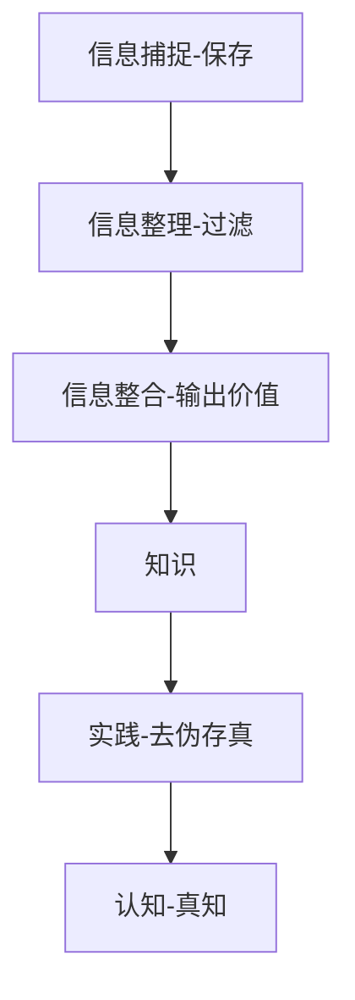
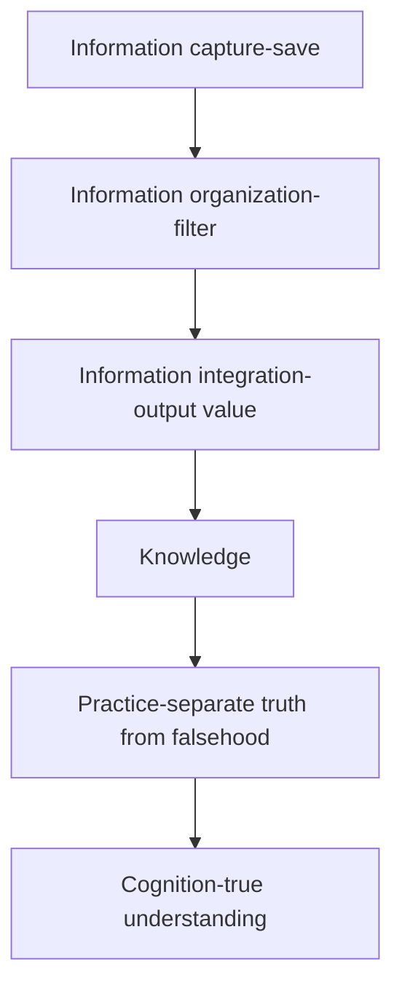

## 工具

### Mermaid

这是 Obsidian 内置画图工具，这个工具的使用需要有的技术背景(如果你有心学习，上手难度并不高，但收益超过学习的时间成本)，我现在基本用它来画图。它的好处是不同于固定的图片，它的修改很简单，约等于管理清单，而且它的图片内容是可以被搜索到的，因为本质上它的背后还是一堆文字。管理文字会比管理附件轻松不少。

案例: 信息产生的过程

## Tools

### Mermaid

This is Obsidian's built-in drawing tool. The use of this tool requires some technical background (if you're willing to learn, it's not difficult to get started, and the benefits outweigh the time cost of learning). I now basically use it to draw diagrams. Its advantage is that unlike fixed images, it's easy to modify, almost equivalent to managing a list, and its image content can be searched because essentially it's still a bunch of text behind the scenes. Managing text is much easier than managing attachments.

Example: The Process of Information Generation

