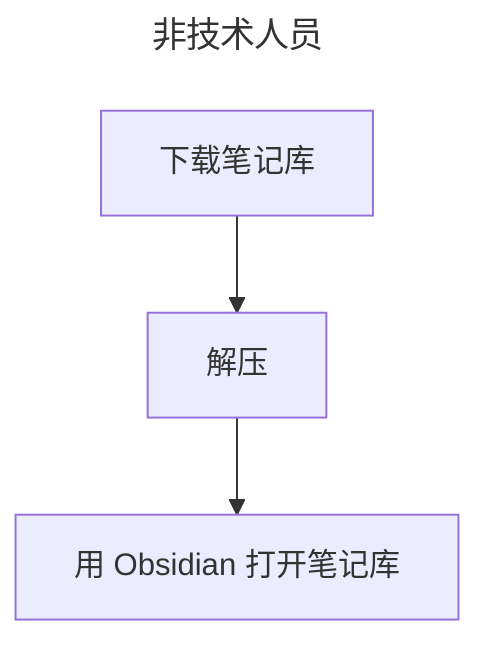
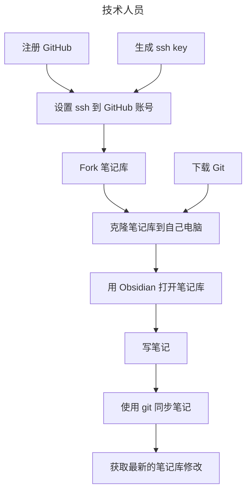

#README

这是一个开源的 obsidian 笔记库，作者是软件工程师，同时也是记录笔记超过 8 年的工作者。这个笔记库的架构帮助我很好的应付工作和生活中的问题和挑战，希望帮助到同样需要整理大量内容信息的你。

- obsidian-notes: https://github.com/xiaokatech/obsidian-notes
- 我想为开源笔记仓库做出贡献: https://wj.qq.com/s2/15685054/9a73/

# 如何使用该笔记库？

<p align="center">
  <a href="./README.md">简体中文</a> |
  <a href="./README_en.md">English</a>
</p>

## 非技术人员



下载笔记库。

![[2024-10-11-img-6-how-to-use-this-notes-repo-download-notes-repo-as-zip.png]]


解压缩，然后用 Obsidian 打开你的笔记仓库。

![[2024-10-11-img-4-how-to-use-this-notes-repo-open-your-notes-repo.png]]


你可以使用 iCloud、Google Drive 或 Microsoft OneDrive 在你的设备之间同步笔记。

> 使用 GitHub 同步  
> 如果你想与 GitHub 同步，请确保你已经安装了 Git 并为你的 GitHub 账户生成了 SSH 密钥。

## 技术人员



Fork 笔记库到你的 GitHub 账户。

![[2024-10-11-img-1-how-to-use-this-notes-repo-repo.png]]


![[2024-10-11-img-2-how-to-use-this-notes-repo-fork.png]]


![[2024-10-11-img-3-how-to-use-this-notes-repo-clone you own notes repo.png]]


```bash
git clone <ssh_github_link>
```

然后用 Obsidian 打开你的笔记仓库。

![[2024-10-11-img-4-how-to-use-this-notes-repo-open-your-notes-repo.png]]


你可以直接在 GitHub 上保存你的笔记,试试在 Obsidian 中使用命令(使用 `Cmd + p` 打开命令面板)。

![[2024-10-11-img-5-how-to-use-this-notes-repo-commit-and-sync-with-Git.png]]


在编写你的第一个笔记之前,请先阅读 [[2024-10-09-README-笔记管理-如何管理工作笔记]] [link (请使用 Obsidian 查看该链接)](2024-10-09-README-笔记管理-如何管理工作笔记.md)。
