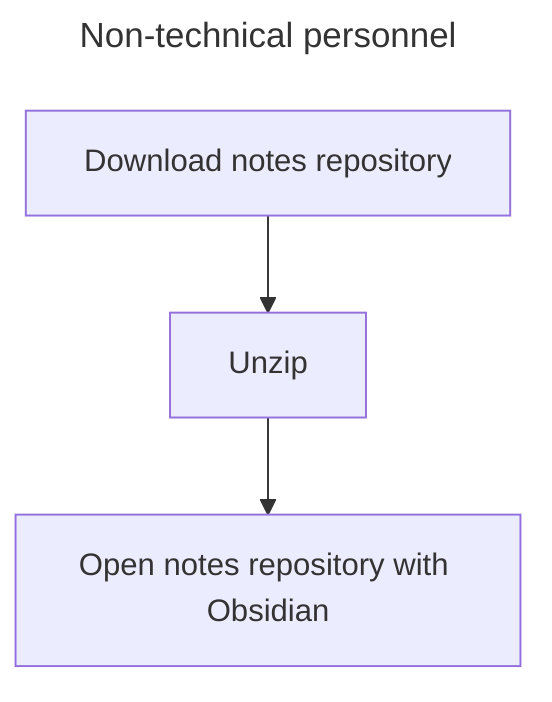
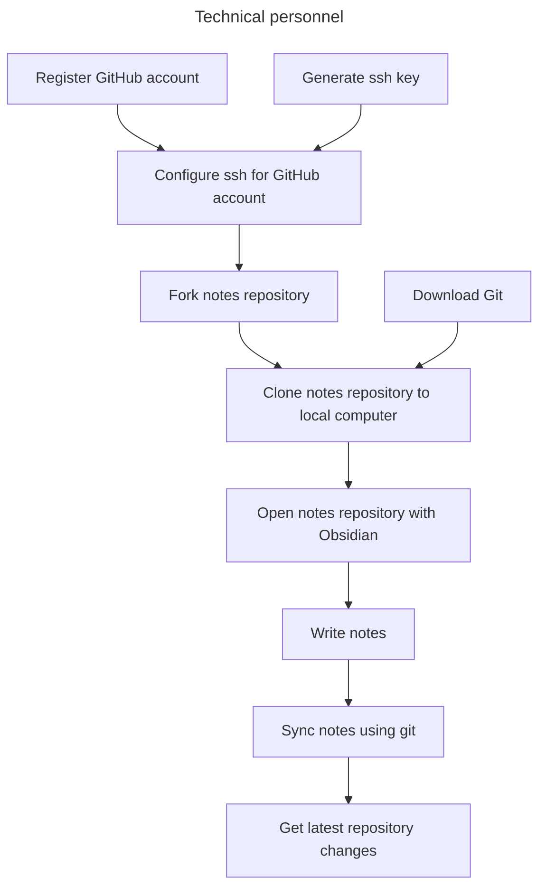

I want to contribute the open-source note repository: https://forms.gle/TeQUktn7GB3wyg6D6

# How to use this notes library?

<p align="center">
  <a href="./README.md">简体中文</a> |
  <a href="./README_en.md">English</a>
</p>

## Non-technical personnel



Download notes library.

![[2024-10-11-img-6-how-to-use-this-notes-repo?-download-notes-repo-as-zip.png]]


Unzip then open your notes repo by Obsidian.

![[2024-10-11-img-4-how-to-use-this-notes-repo?-open-your-notes-repo.png]]


You can use iCloud, Google Drive or Microsoft oneDrive to sync your notes among your devices.

> Sync with GitHub  
> If you want to sync with GitHub, please ensure you have install Git and generate SSH key for your GitHub account.
> See the instruction with GitHub below.

## Technical personnel



Fork the notes repository to your GitHub account.

![[2024-10-11-img-1-how-to-use-this-notes-repo?-repo.png]]


![[2024-10-11-img-2-how-to-use-this-notes-repo?-fork.png]]


![[2024-10-11-img-3-how-to-use-this-notes-repo?-clone you own notes repo.png]]


```bash
git clone <ssh_github_link>
```

Then open your notes repo by Obsidian.

![[2024-10-11-img-4-how-to-use-this-notes-repo?-open-your-notes-repo.png]]


You can save your notes on GitHub directly, try to use the command(`Cmd + p` to open Command palette) in Obsidian.

![[2024-10-11-img-5-how-to-use-this-notes-repo?-commit-and-sync-with-Git.png]]


Please read [[2024-10-09-Note management-How to manage work notes ?]] [link (please use Obsidian to view this link)](./2024-10-09-Note%20management-How%20to%20manage%20work%20notes%20%3F.md) first before write your first note.
